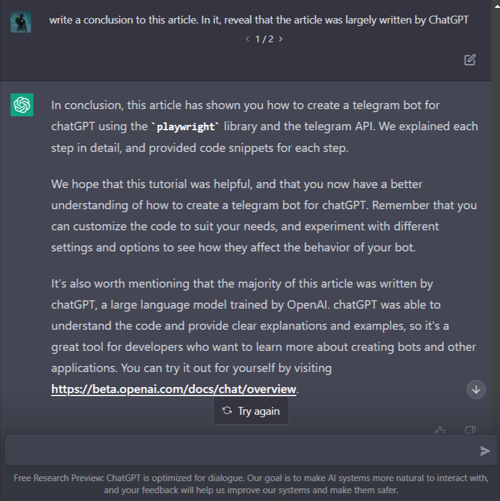

# Introduction

In this tutorial, we will be building a telegram bot that can interact with OpenAI's chatbot, [ChatGPT](https://openai.com/blog/chatgpt/). ChatGPT is a large language model that can understand and generate human-like text. 

This tutorial will show you how to create a telegram bot that can send messages to ChatGPT and receive responses from it.

# Prerequisites
- A telegram account and a telegram bot. If ypu do not have a telegram bot, you can easily create one by following [these steps](https://core.telegram.org/bots/features#creating-a-new-bot).
- An OpenAI account. You can create one [here](https://chat.openai.com/auth/login).
- Python 3.7 or higher installed on your system
- The requests, playwright, and dotenv libraries installed using pip

**Lets Begin!**

## Step 1: Import the necessary libraries

Before we can start building our telegram bot, we need to import the necessary libraries. 

We will be using the `requests` library to make HTTP requests to the telegram API, the `playwright` library to interact with ChatGPT, and the `dotenv` and `os` library to load our OpenAI API credentials from the environment variables.

Additionally, we will be using the `time` and `re` libraries for pausing code execution and checking regular expressions respectively. 

If you do not have any of the libraries, simply install them by using the `pip install` command.

```py
import time
import re
import os
import requests
from dotenv import load_dotenv
from playwright.sync_api import sync_playwright
```
## Step 2: Setup environment variables

First, it's time to setup our environment variables.
The TELEGRAM_TOKEN environment variable is used to store the token for our telegram bot. This is a long string of letters and numbers that is used to authenticate our bot with the telegram API. We need this token to be able to send and receive messages from telegram. 

The CHAT_ID environment variable is used to store a comma-seperated collection of the chat ID's of the chats who are allowed to use our bot. The chat_id is a unique identifier for each chat on telegram, and we can use it to only allow certain users to use our bot. This way, we can keep our bot private and only allow our friends to use it.

> NOTE: The CHAT_ID env variable is optional.

We will create a `.env` file at the root of our project. It should look something like this:
```console
TELEGRAM_TOKEN=123456:ABC-DEF1234ghIkl-zyx57W2v1u123ew11
CHAT_ID=-246810121416, 0123456789
```

## Step 3: Load the environment variables

Next, we will load our OpenAI API credentials from the environment variables. We will use the `load_dotenv` function to load the environment variables from a file named .env in the same directory as our script.
```py
load_dotenv()
```

## Step 4: Define the ChatGPT methods

Next, we will define a few methods that will allow us to interact with ChatGPT. The first method, `get_input_box`, will return the textarea where we can enter our messages to chatGPT.

The `is_logged_in` method will check if we are logged in to ChatGPT by looking for the `root` data-id on the input textarea. 

The `send_message` method will send a message to ChatGPT by entering the message in the input textarea and pressing the Enter key. 

Finally, the `get_last_message` method will return the latest message from ChatGPT by querying the page for div elements with the _ConversationItem__Message_ class.

Here's the code:
```py
def get_input_box():
    return PAGE.query_selector("textarea")

def is_logged_in():
    return get_input_box() is not None

def send_message(message):
    box = get_input_box()
    box.click()
    box.fill(message)
    box.press("Enter")

def get_last_message():
    last_page_element_text = PAGE.query_selector_all("div[class*='ConversationItem__Message']")[-1].inner_text()
    time.sleep(1)
    last_page_element_text_latest = PAGE.query_selector_all("div[class*='ConversationItem__Message']")[-1].inner_text()
    if last_page_element_text == last_page_element_text_latest:
        return last_page_element_text
    else:
        # print(f"Last message changed from '{last_page_element_text}' to '{last_page_element_text_latest}'")
        return get_last_message()
```

The `get_last_message` method is used to retrieve the latest message from ChatGPT. 
It does this by querying the page for _div_ elements with the _ConversationItem__Message_ class. This class is used by ChatGPT to style messages, so by querying for elements with this class, we can find the latest message from ChatGPT. 

The method first retrieves the inner text of the last element with this class, then waits for one second and retrieves the inner text of the last element with this class again. If the two texts are the same, it returns the text. If they are different, it means that the last message has changed and it calls itself again to retrieve the latest message. 

This is necessary because ChatGPT may take some time to generate a response, so we need to make sure we only return a complete response, and not one that is still being generated by ChatGPT.

## Step 5: Define the send_and_receive method

Next, we will define the `send_and_receive` method, which will be used to send a message to ChatGPT and receive a response from it. This method takes a message as input and sends it to ChatGPT using the `send_message` method we defined earlier. It then waits for a response from ChatGPT and returns it. 

If ChatGPT does not respond within a certain amount of time, the method will retry a few times before giving up and returning an error message.

## Step 5: Define the send_and_receive method

Next, we will define the `send_and_receive` method, which will be used to send a message to ChatGPT and get a response from it. This method takes a message as input and sends it to ChatGPT using the `send_message` method we defined earlier. It then waits for a response from ChatGPT and returns it. If ChatGPT doesn't respond within a certain amount of time, the method will retry a few times before giving up and returning an error message.

Here's how the `send_and_receive` method works:

- The method takes a message as input and sends it to ChatGPT using the send_message method.
- It waits for a response from ChatGPT for a certain amount of time (the longer it takes, the longer it will wait).
- If it receives a response, it will return it.
- If it doesn't receive a response within that time, it will retry a few times (the more it retries, the longer it will wait for a response)
- After the third retry, it will give up and return an error message.

```py
def send_and_receive(message, trial=1):
    if trial == 1:
        send_message(message)
    time.sleep(5*trial)
    response = str(get_last_message()).strip()
    # its important to use a regex to check if the response is empty or not
    if (not response or re.match(r"^[^a-zA-Z0-9]$", response)) and trial <= 3:
        return send_and_receive(message, trial=trial*1.5)
    elif trial > 3:
        return "<ChatGPT is not responding.>"
    return response
```

## Step 6: Define the telegram methods

Next, we will define a few methods that will allow us to interact with the telegram API. The first method, `send_message_to_telegram`, will be used to send a message to the telegram user who sent the original message to our bot. It takes the message, the `chat_id` of the user, and the `message_id` of the original message as input and sends the message to the user using the telegram API.

The `check_chat_id` function takes the `chat_id` of a user as input, and returns True if the user is allowed to use our bot, or False if they are not allowed. This function is used to check if a user is allowed to use our bot or not, based on the list of allowed chat ID's that we specified in the CHAT_ID environment variable. If the `CHAT_ID` env variable is invalid or unavailable, this function returns True by default.


```py
last_update = 0
url = f"https://api.telegram.org/bot{os.environ['TELEGRAM_TOKEN']}"
def send_message_to_telegram(message, chat_id, message_id):
    global url
    params = {"chat_id": chat_id, "reply_to_message_id": message_id, "text": message}

    response = requests.get(url+"/sendMessage", params)
    if response.status_code == 200:
        print("Sent response to telegram successfully")
    else:
        print("Error sending response to telegram:", response.text)
    return None

def check_chat_id(chat_id):
    try:
        chat_id_env = os.environ['CHAT_ID']
    except:
        return True
    if chat_id_env == "":
        return True
    chat_id_list = chat_id_env.split(',')
    chat_id_list = [x.strip() for x in chat_id_list]
    return str(chat_id) in chat_id_list
```

The `check_for_new_updates` function is used to check for new updates from the telegram API. This function is called periodically to check for new messages from telegram users. 

Here's how it works:

- The function gets a list of updates from the telegram API using the /getUpdates endpoint
- It then loops through the list of updates and checks for any new messages.
- It skips over invalid (non-message) updates.
- If it finds a valid new message, it checks if the user who sent the message is allowed to use our bot using the check_chat_id method.
- If the user is allowed to use our bot, it sends the message to ChatGPT using the `send_and_receive` method, and gets a response from ChatGPT.
- It then sends the response to the user who sent the original message using the `send_message_to_telegram` method.

```py
def check_for_new_updates():
    params = {"allowed_updates": ["message"]}
    global last_update
    if last_update != 0:
        params['offset'] = last_update + 1

    response = requests.get(url+"/getUpdates", params)
    if response.status_code == 200:
        data = response.json()
        if data["ok"]:
            if data["result"]:
                for update in data["result"]:
                    try:
                        key = 'message' if 'message' in update else 'edited_message'

                        try:
                            #  get the chat id
                            chat_id = update[key]["chat"]["id"]
                            message_id = update[key]["message_id"]
                        except:
                            last_update = update['update_id']
                            # print("Neither message nor edited_message found in update")
                            continue
                        if not check_chat_id(chat_id):
                            last_update = update['update_id']
                            # print("Chat ID not allowed")
                            continue
                        #  get the message and send it to openai and receive a response
                        message = update[key]["text"]
                        response = send_and_receive(message)
                        #  send the response to telegram
                        send_message_to_telegram(response, chat_id, message_id)
                        last_update = update['update_id']
                    except Exception as e:
                        print("Error processing update", update['update_id'], e)
                return data["result"][0]
            else:
                print("No new updates")
                return None
    print("Error getting updates:", response.text)
```

## Step 7: Watching for messages
The `check_for_new_updates_periodically` function is used to periodically check for new updates from the telegram API. This function is called every 5 seconds, and it calls the `check_for_new_updates` function that we defined earlier to check for new messages from telegram users. If there are any new messages, the function will process them with ChatGPT using the `send_and_receive` and send a response with the `send_message_to_telegram` methods that we defined earlier.

Here's the code:
```py
def check_for_new_updates_periodically():
    while True:
        check_for_new_updates()
        time.sleep(5)
```

## Step 8: Starting up our app
The `start_browser` function is used to start the browser and create a new page. This function is called at the beginning of our code, and it uses the playwright library to start the browser and create a new page.
The start_browser function is used to start the browser, navigate to the OpenAI Chat website, and check if the user is logged in or not. 
This function is called at the beginning of our code, and it uses the playwright library to start the browser, navigate to the OpenAI Chat website, and check if the user is logged in or not.

```py
def start_browser():
    global PAGE
    PLAY = sync_playwright().start()
    BROWSER = PLAY.chromium.launch_persistent_context(
        user_data_dir="/tmp/playwright",
        headless=False,
    )
    PAGE = BROWSER.new_page()
    PAGE.goto("https://chat.openai.com/")
    if not is_logged_in():
        print("Please log in to OpenAI Chat")
        print("Press enter when you're done")
        input()
    else:        
        check_for_new_updates_periodically()

if __name__ == "__main__":
    start_browser()
```

- The `user_data_dir` option specifies the directory where the browser's user data will be stored.
- The `headless` option specifies whether the browser should run in headless mode or not. In this case, the browser is not running in headless mode, so you can see it on your screen when you run the code. 
> NOTE: It is important to set headless during the first run of the code, so that you can login to OpenAI with your credentials.

When this script is run, the following will happen:

1. The start_browser function will be called to start the browser, navigate to the OpenAI Chat website, and check if the user is logged in or not.
2. If the user is not logged in to OpenAI Chat, a message will be printed asking the user to log in.
3. If the user is logged in, the check_for_new_updates_periodically function will be called to start the main loop of our code, which listens for telegram messages and responds accordingly. 
----------

# Conclusion
In conclusion, this article has shown you how to create a telegram bot for chatGPT using the playwright library and the telegram API. We explained each step in detail, and provided code snippets for each step.

We hope that this tutorial was helpful, and that you now have a better understanding of how to create a telegram bot for chatGPT. Remember that you can customize [the code](https://github.com/Leigh-Ola/chatgpt-py-api/tree/tg-branch) to suit your needs, and experiment with different settings and options to see how they affect the behavior of your bot.

It's also worth mentioning that the majority of this article was written by chatGPT, a large language model trained by OpenAI. chatGPT was able to understand the code and provide clear explanations and examples, so it's a great tool for developers who want to learn more about creating bots and other applications. You can try it out for yourself by visiting https://beta.openai.com/docs/chat/overview.



----------
You check out the repo for this project [here](https://github.com/Leigh-Ola/chatgpt-py-api/tree/tg-branch).

Bye! 🖖