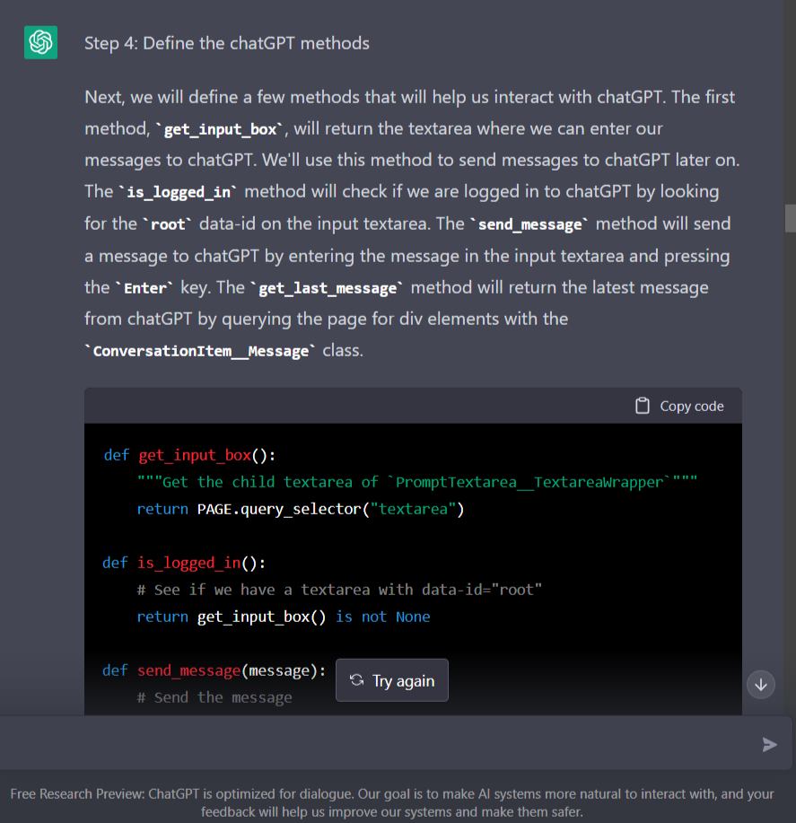
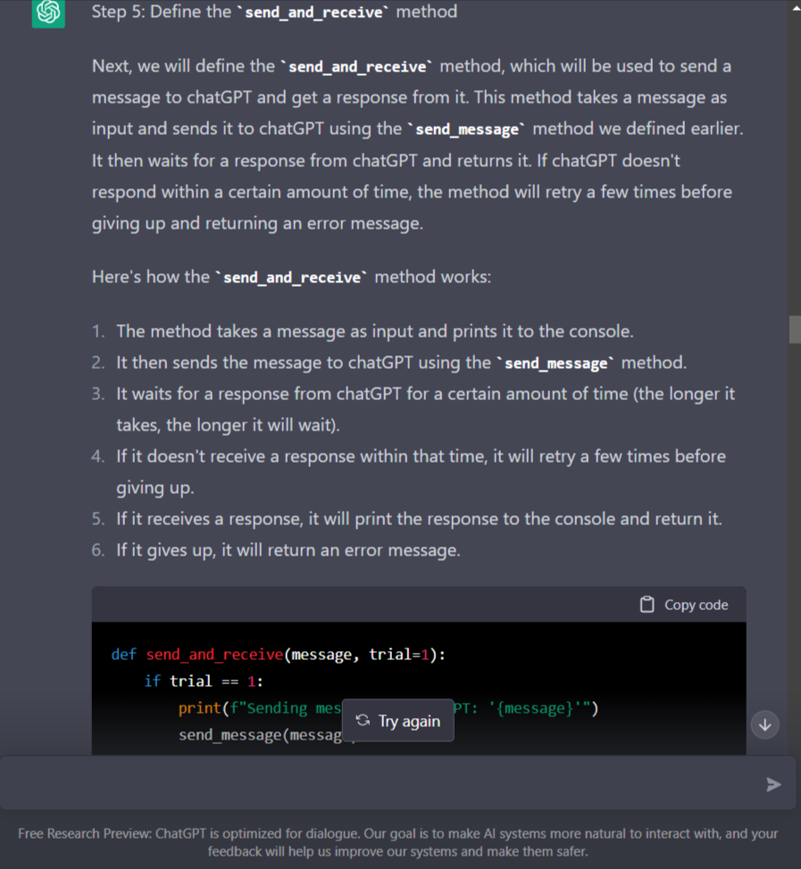
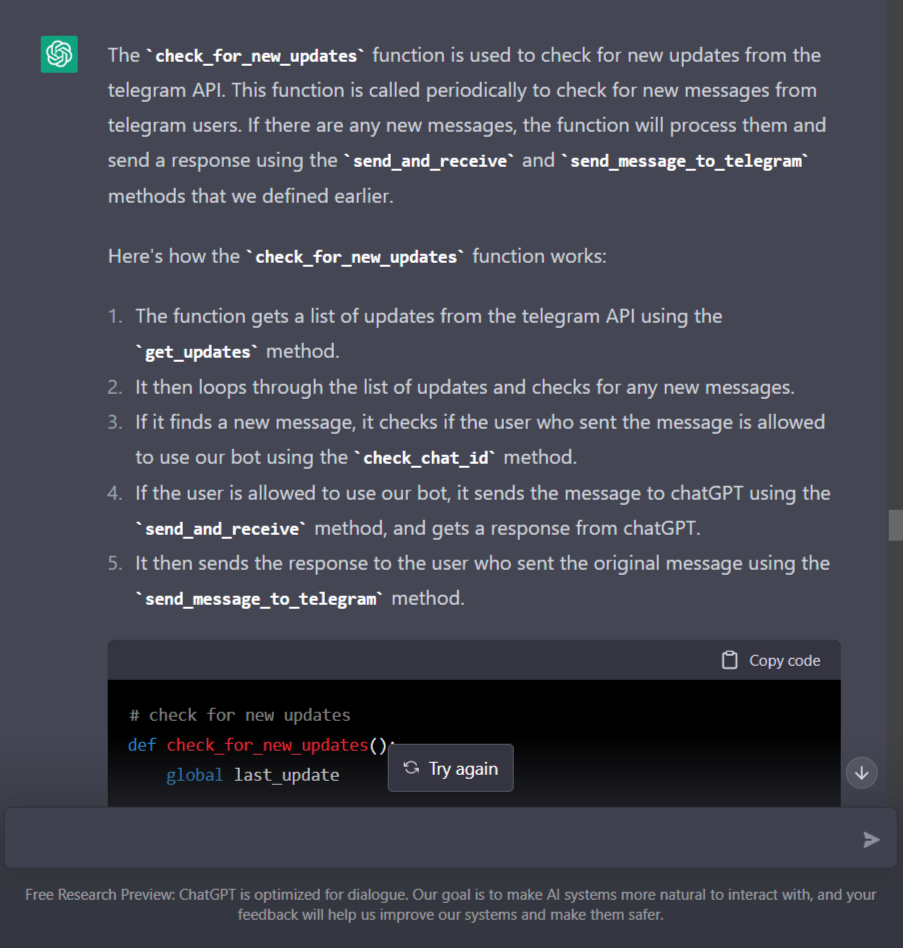

# ChatGPT Telegram Bot

* It uses playwright and chromium to open a browser instance and parse html.
* For development purpose only.


# How to install

* Make sure that python and virual environment is installed.

* Now Install the dependencies from `requirements.txt`

```
python requirements.txt
```

* If you are installing playwright for the first time, it will ask you to run this command for one time only.

```
playwright install
```

* Now run the server

```
python server.py
```

# Credit

### Thanks to 
- [Daniel Gross](https://github.com/danielgross/whatsapp-gpt). He initially built this as a whatsapp bot that interacts with chatGPT.
- [Taranjeet](https://github.com/taranjeet/chatgpt-api): He took the script as an individual file and added documentation for how to install and run it with python.

# Article
The article associated with this repo is available here: [Creating a Telegram chatbot with ChatGPT: A Step-by-Step Guide](https://dev.to/leighola/creating-a-telegram-chatbot-with-chatgpt-a-step-by-step-guide-42gg).

The article was largely written by ChatGPT. Here are some screenshots:
 
 
 
 